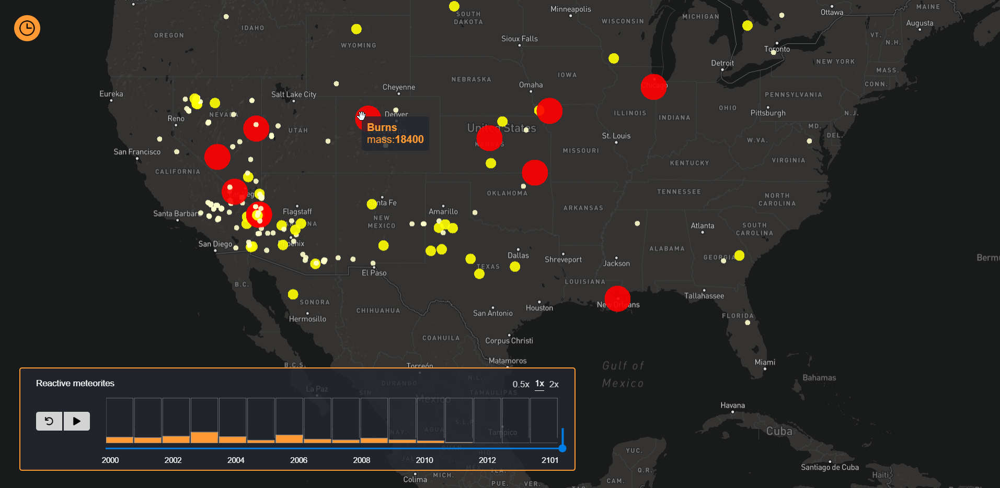
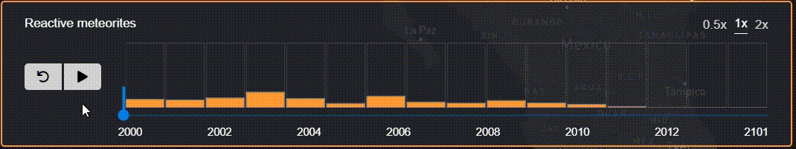

# DECK.GL Time Slider implementation :hourglass: [demo](https://adrisolid.github.io/DECK-GL-Time-Slider/)

<h4>I need some caffeine to work :)</h4>
<a href='https://ko-fi.com/R6R01NRMJ' target='_blank'></a>

***



A React-Redux Time Slider implementation that allows you to render temporal (or even non-temporal) data. The example is fully integrated with
the [DECK.GL](https://deck.gl/#/) library, a WebGL-powered framework for visual exploratory data analysis of large datasets. The example is filtering the data array on the CPU.



This [demo](https://adrisolid.github.io/DECK-GL-Time-Slider/) shows a [scatterplot](https://deck.gl/#/documentation/deckgl-api-reference/layers/scatterplot-layer) meteorites world layer.

## Description

It uses a simple [Material UI slider](https://material-ui.com/) and keeps the features until the end, that means that it is
holding the features rendered.
A bar chart is showing the data per date; an 'on hover' event shows the numeric accumulation in a little left container.
It is also possible to restart the animation clicking the 'undo' button.

## To run

- You'll need to have [git](https://git-scm.com/) and [node](https://nodejs.org/en/) installed in your system.
- Fork and clone the project:

```
git clone https://github.com/AdriSolid/DECK.GL-Time-Slider.git
```

- Then install the dependencies:

```
npm install
```

- Start, check => localhost:8080

```
npm start
```
