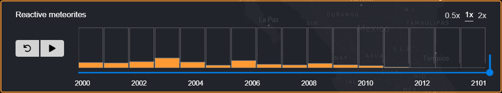

# DECK.GL Time Slider Component :hourglass:

A React-Redux Time Slider component that allows you to render temporal (or even non-temporal) data. The component is fully integrated with 
the [DECK.GL](https://deck.gl/#/) library, a WebGL-powered framework for visual exploratory data analysis of large datasets. 



This [demo](https://github.com/AdriSolid/DECK-GL-Time-Slider) shows a [scatterplot](https://deck.gl/#/documentation/deckgl-api-reference/layers/scatterplot-layer) meteorites world layer.

## Description
The component uses a simple [Material UI slider](https://material-ui.com/) and keeps the features until the end, that means that it is
holding the features rendered.
Some svgs as charts are showing the data per date; an 'on hover' event shows the numeric accumulation in a little left container.
It is also possible to restart the animation clicking the 'undo' button.

## To run

* You'll need to have [git](https://git-scm.com/) and [node](https://nodejs.org/en/) installed in your system.
* Fork and clone the project:

```
git clone https://github.com/AdriSolid/DECK.GL-Time-Slider.git
```

* Then install the dependencies:

```
npm install
```

* Start, check => http://127.0.0.1:3000/

```
npm start
```
